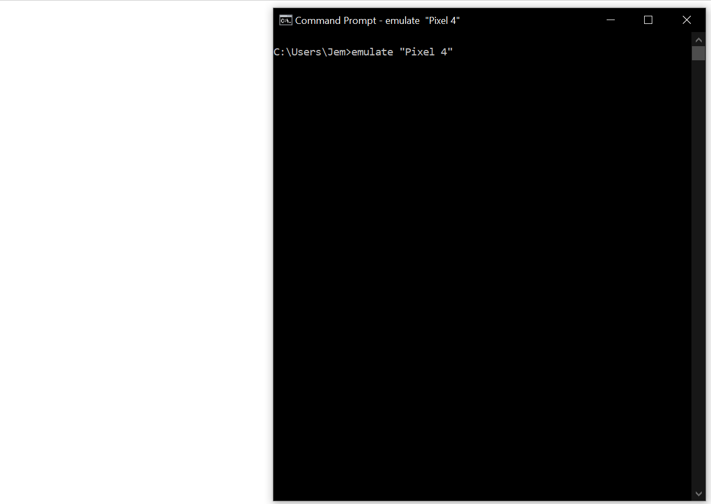

EasyAndroidEmulator
===================

[](https://oclif.io)
[](https://npmjs.org/package/EasyAndroidEmulator)
[](https://npmjs.org/package/EasyAndroidEmulator)
[](https://github.com/Chrisvin/EasyAndroidEmulator/blob/master/package.json)

<p align="center"></p>

Create and run android emulators in a quick & easy manner with just device name/model.
Use the various flags to customize the emulator as per your requirements.

## Setting up the dependency
### Install using npm
```sh-session
$ npm install -g EasyAndroidEmulator
```

## Usage
### Just call `emulate` to for default device
```sh-session
$ emulate
```
### Pass in Device Name or Model as the argument
```sh-session
$ emulate "Pixel 4 XL"
```

Details of the device are automatically fetched, but if needed, they can be customized using the appropriate flags.

## Flags
| Flag | Description |
| :-: | :-: |
| -h, --help | show CLI help |
| --version | show CLI version |
| -v, --verbose | show verbose logs |
| -n, --name | name of the AVD to be (created &) used |
| -p, --persist | persist the created avd (makes it faster for subsequent runs) |
| -f, --force | force recreation of the emulator avd |
| --android | set the android API level for the AVD (Use along with -f flag if AVD already exists) |
| --abi | set the preferred ABI for the AVD (Use along with -f flag if AVD already exists) |
| -r, --resolution | set the resolution of the AVD (Use along with -f flag if AVD already exists). Eg: -r 1080x2160 |
| -d, --density | set the density of the AVD (Use along with -f flag if AVD already exists). Eg: -d 440 |

## Examples

1. Create emulator with Samsung Galaxy M51 Specs, but with 800x1280 resolution & 240 density, which is persisted for future reuse.
```sh-session
$ emulate m51 -r 800x1280 -d 240 -p
```

2. Create emulator with Pixel 4 Specs, but with android API 25 and x86_64 ABI. (With verbose logs)
```sh-session
$ emulate "Pixel 4" --android 25 --abi x86_64 -v
```

## Bugs and Feedback
For bugs, questions and discussions please use the [Github Issues](https://github.com/Chrisvin/EasyAndroidEmulator/issues).

## License
```
MIT License

Copyright (c) 2020 Jem

Permission is hereby granted, free of charge, to any person obtaining a copy
of this software and associated documentation files (the "Software"), to deal
in the Software without restriction, including without limitation the rights
to use, copy, modify, merge, publish, distribute, sublicense, and/or sell
copies of the Software, and to permit persons to whom the Software is
furnished to do so, subject to the following conditions:

The above copyright notice and this permission notice shall be included in all
copies or substantial portions of the Software.

THE SOFTWARE IS PROVIDED "AS IS", WITHOUT WARRANTY OF ANY KIND, EXPRESS OR
IMPLIED, INCLUDING BUT NOT LIMITED TO THE WARRANTIES OF MERCHANTABILITY,
FITNESS FOR A PARTICULAR PURPOSE AND NONINFRINGEMENT. IN NO EVENT SHALL THE
AUTHORS OR COPYRIGHT HOLDERS BE LIABLE FOR ANY CLAIM, DAMAGES OR OTHER
LIABILITY, WHETHER IN AN ACTION OF CONTRACT, TORT OR OTHERWISE, ARISING FROM,
OUT OF OR IN CONNECTION WITH THE SOFTWARE OR THE USE OR OTHER DEALINGS IN THE
SOFTWARE.
```
